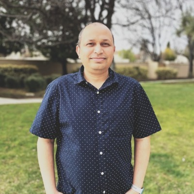

# About Me  
  

I'm **Ravi Kiran Nukala**, a Senior Director of Software Engineering based in Hayward, California. With over two decades of experience in software engineering, I've focused on building scalable SaaS platforms, leading global engineering teams, and driving innovation in AI and cloud technologies.  

I created **Ravi Learns** to document my ongoing exploration of:  
- AI & LLMs  
- Engineering leadership  
- Software architecture  
- Data & integrations  
- DevOps & cloud infrastructure  
- Personal projects and technical experiments  

Throughout my career, I've been drawn to the practical application of emerging technologies. I enjoy building agentic workflows, developing tools like DreamNestAI, and sharing insights on architecture, leadership, and technology that I've gained through hands-on experience.  

This site serves as a continuous-learning journal where I share knowledge, reflect on what I've learned, and document my journey building in public. Thanks for visiting.
